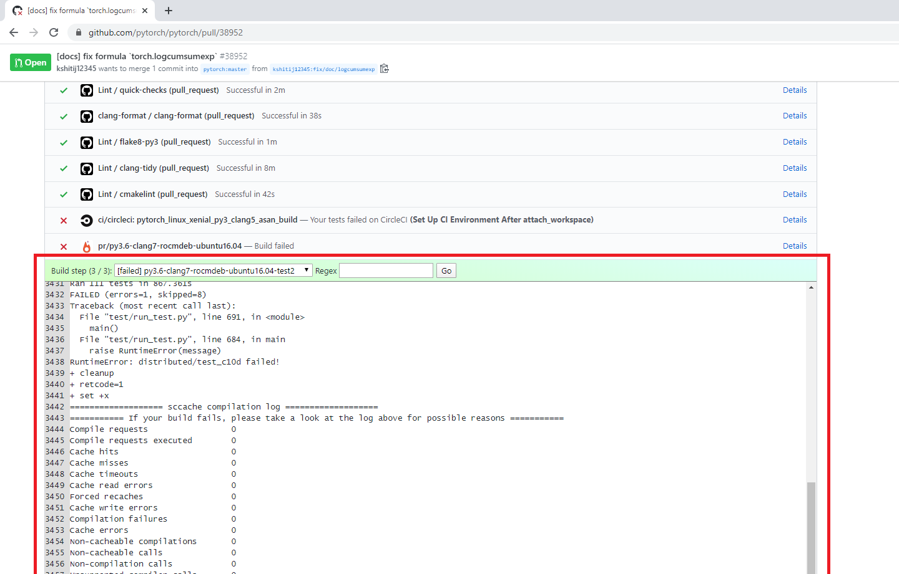

# GitHub CI Viewer

GitHub CI Viewer is a Chrome extension is a log viewer that fetches CI results
from various providers and displays them directly on GitHub pull requests.
Click the bar of a CI item to view its associated logs (typically the same
information you would get from following the "details" link).
The red rectangle below shows an example.

## Supported Providers

- CircleCI
- Azure
- Jenkins
